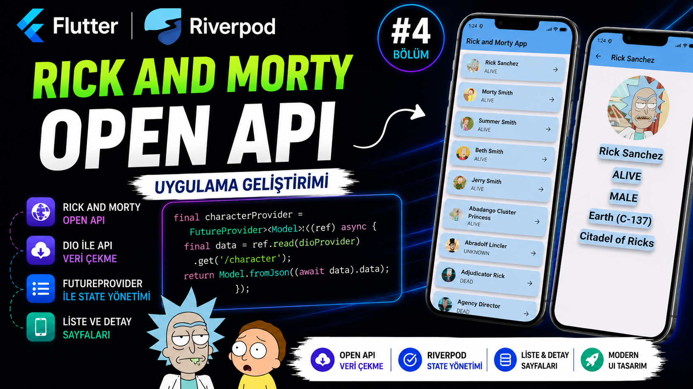

# Flutter Rick and Morty App with Riverpod

  

Bu proje, Flutter Riverpod serimin 4. videosunda geliştirdiğimiz örnek uygulamadır.

Rick and Morty API kullanılarak karakterler listelenmekte ve seçilen karakterin detay bilgileri gösterilmektedir.

## 🚀 Kullanılan Teknolojiler

- Flutter
- Dart
- Riverpod
- Dio
- REST API

## 📚 Bu Projede

- ProviderScope kullanımı
- Dio ile API isteği
- FutureProvider
- JSON model oluşturma
- API'den gelen verileri listeleme
- Karakter detay sayfası oluşturma

## 🌐 API

Rick and Morty API

https://rickandmortyapi.com/

## 🎥 YouTube Videosu

Bu proje, Flutter Riverpod serisinin 4. bölümünde sıfırdan geliştirilmiştir.

https://www.youtube.com/watch?v=hp7MYXoMQ1c